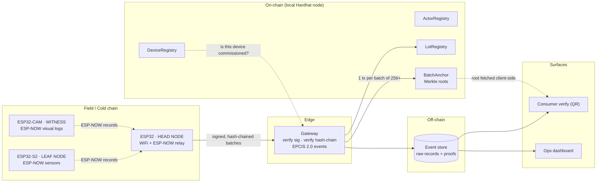

# KrishiChain

**Low-cost IoT blockchain nodes for farm-to-fork traceability.**
IIC 2026 · Problem Statement 06 · AgriTech

> Trust you can verify — from the farm gate to your fork.

---

## The one-paragraph version

Putting supply-chain data on a blockchain does not make it true. It makes it *immutable* —
and immutable garbage is still garbage. KrishiChain closes that gap by pushing cryptography
**down into ₹400–900 sensor nodes**: every temperature, humidity and tamper reading is signed on
the ESP32 by a private key that never leaves the chip, and each record is hash-chained to the
one before it. A heterogeneous swarm — ESP32 HEADs, S2 Lolin LEAFs, ESP32-CAM witnesses and
phone virtual-nodes — relays everything to a laptop field base with ESP-NOW → WiFi fallback,
so evidence gets out one way or another. See [ADR-0004](docs/adr/0004-heterogeneous-swarm.md). The result is a data stream that is **attributable** (this exact commissioned
device said this), **gapless** (records cannot be silently dropped or reordered, even while
offline), and **independently verifiable** (a consumer's phone recomputes a Merkle proof
against a root read from a chain node — a process it never trusts our gateway to speak for).

## What a judge can do in 90 seconds

1. Scan the QR on a tomato crate → see its journey: farm → aggregator → cold truck → retail.
2. Press **Verify independently** → the browser fetches the Merkle root straight from the
   chain node (not from our gateway) and recomputes the proof locally. Green badge = the
   data existed at anchor time, unaltered.
3. Open the cold box lid → the LEAF node logs a tamper + temperature excursion → the lot is
   flagged **COLD-CHAIN BREACH** on-chain within seconds, and the consumer page reflects it.
4. Pull the WiFi. The HEAD node keeps recording into its hash-chained flash buffer. Plug it back in →
   the entire gapless run uploads and verifies. Nothing was lost, nothing could be rewritten.

## Architecture at a glance



## Repository map

| Path | What lives here | Owner |
|---|---|---|
| `docs/` | PRD, architecture, protocol spec, team plan, demo script | All |
| `firmware/node-head/` | ESP32 WiFi relay + ESP-NOW coordinator | H1 |
| `firmware/node-leaf/` | ESP32-S2 deep-sleep sensor node (ESP-NOW) | H1 |
| `firmware/node-cam/` | ESP32-CAM witness node (ESP-NOW) | H1 |
| `firmware/lib/krishi/` | Shared C++ lib: identity, signing, hash chain, ring buffer | H1 |
| `contracts/` | Solidity (Hardhat + viem) | S1 |
| `apps/gateway/` | Fastify ingest, verification, Merkle batcher, anchor service | S1 |
| `apps/web/` | Next.js consumer verify + ops dashboard | S2 |
| `packages/core/` | Canonical encoding, Merkle, signature verify, EPCIS types | S1 |
| `hardware/` | BOM, wiring diagrams, enclosure, calibration logs | H2 |

## Quick start

```bash
npm install
npm run dev
```

### Firmware development (ESP32 nodes)

For PlatformIO setup (board detection, driver installation, build config):

**Windows:**
```bash
setup-pio.bat
```

**macOS / Linux:**
```bash
bash setup-pio.sh
```

Or follow the [PlatformIO Setup Guide](docs/PLATFORMIO-SETUP.md) for step-by-step instructions.

See [docs/RUNBOOK.md](docs/RUNBOOK.md) for the full setup, including firmware flashing and
the offline demo chain.

## Documents

| Doc | Read it when |
|---|---|
| [PRD.md](docs/PRD.md) | You want the what and the why. Start here. |
| [ARCHITECTURE.md](docs/ARCHITECTURE.md) | You are writing code. |
| [PROTOCOL.md](docs/PROTOCOL.md) | You touch anything crossing device ↔ gateway ↔ chain. |
| [HARDWARE.md](docs/HARDWARE.md) | You are holding a soldering iron. |
| [TEAM-PLAN.md](docs/TEAM-PLAN.md) | You want to know what *you* are building today. |
| [TASKS.md](TASKS.md) | You are about to open Claude Code. |
| [DEMO-SCRIPT.md](docs/DEMO-SCRIPT.md) | It is pitch day. |
| [JUDGING.md](docs/JUDGING.md) | You want to know what they will ask and what we answer. |

## Team

| Role | Track | Owns |
|---|---|---|
| **H1**  | Hardware | Firmware, device identity, crypto, offline buffer, uplink |
| **H2** | Hardware | Sensors, power, enclosure, tamper rig, calibration, demo props |
| **S1** | Software | Contracts, gateway, Merkle/anchor pipeline, `packages/core` |
| **S2** | Software | Consumer verify UI, ops dashboard, QR/labels, pitch assets |

## Licence

MIT — see [LICENSE](LICENSE).
