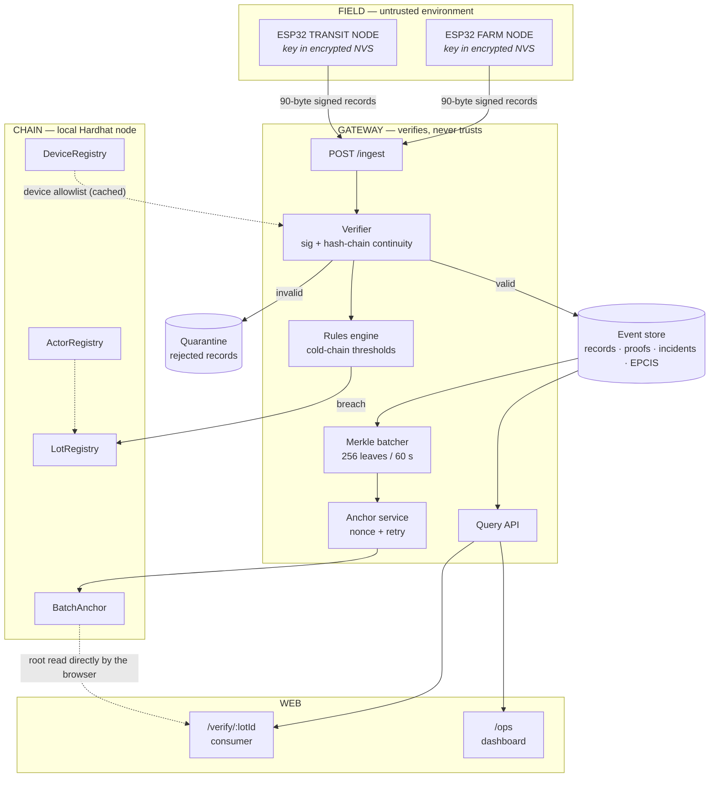
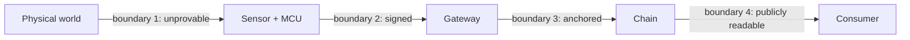
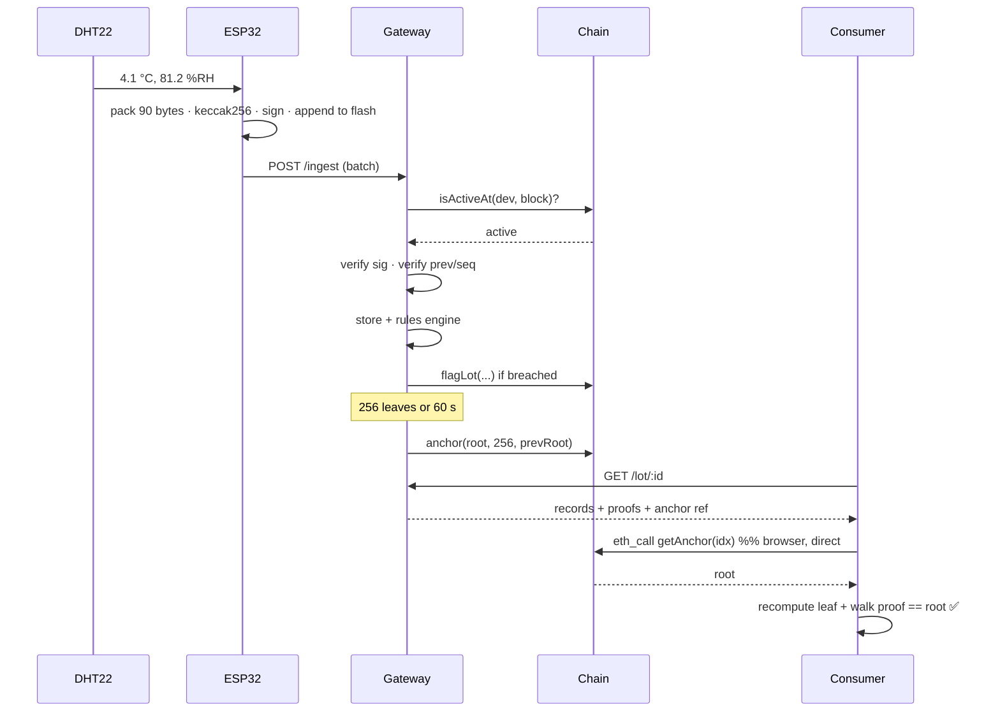

# KrishiChain Architecture

Read [PRD.md](PRD.md) first for the *why*. This document is the *how*, and it is binding on
implementation. [PROTOCOL.md](PROTOCOL.md) owns everything crossing a process boundary.

---

## 1. System shape



### The one rule that shapes everything

**Nothing between the sensor and the consumer is trusted.** Each hop either carries a
verifiable proof or is explicitly marked unverifiable. This is why:

- signing happens on the node, not the gateway;
- the gateway *verifies before storing*, so the database cannot become a laundering step;
- the consumer page reads the anchor root from a public RPC rather than from our API;
- `UNVERIFIABLE` is a rendered UI state, not an error swallowed in a log.

---

## 2. Component design

### 2.1a Swarm layer (ADR-0004) — heterogeneous nodes, laptop base

Four device classes speak one record format (PROTOCOL v1 frozen):

| Class | Role | Sensors | Uplink |
|---|---|---|---|
| ESP32 DevKit | HEAD — senses, buffers, forwards | T/H + tamper | ESP-NOW rx + WiFi/MQTT to laptop |
| ESP32-S2 Lolin | LEAF — dense cheap sensing | T/H/light | ESP-NOW to HEAD; WiFi direct fallback |
| ESP32-CAM | WITNESS — visual evidence | photo hash + lid verdict | WiFi to laptop (companion attestation) |
| Phone PWA | VIRTUAL — GPS + motion + camera backup | GPS/IMU/camera | WiFi/MQTT direct; BLE advertise for proximity |

Rules: relay never rewrites `dev,sig,seq,prev` — gateway verifies end-to-end.
CAM/GPS/IMU ride as companions linked by `(dev, seq, digest)`, never inside
the 90 canonical bytes. Transport fallback: LEAF→ESP-NOW→HEAD, HEAD-loss→WiFi
direct, no-net→flash buffer. Heads heartbeat; leafs pick strongest RSSI.

Swarm behaviours (the selling point): 2-of-3 consensus breach (temp + CAM lid
+ IMU shock, same lot/window), adaptive sampling broadcast (30s→10s on
incident), custody-follow by proximity (nearest node subscribes to lot).

Dashboard is web, not Unity: Leaflet field map + R3F box-per-crate twins
(colour = temp, badge = proof state), live over MQTT-WS from the laptop
gateway. Unity is P2 replay-only.

### 2.1 Node firmware (`firmware/`)

PlatformIO, Arduino-ESP32 core, C++17.

```
firmware/
├── lib/krishi/           # shared library, unit-testable on the host
│   ├── identity.{h,cpp}      # TRNG keygen, NVS storage, address derivation
│   ├── record.{h,cpp}        # 90-byte canonical packing (PROTOCOL §1.3)
│   ├── chain.{h,cpp}         # seq/prev bookkeeping
│   ├── ringbuffer.{h,cpp}    # flash-backed circular buffer, crash-safe
│   ├── uplink.{h,cpp}        # HTTP batching, ackSeq flow control, backoff
│   ├── crypto/               # micro-ecc (secp256k1) + keccak256
│   └── sensors/              # DHT22, LDR, reed, MPU6050 behind one interface
├── node-farm/src/main.cpp
├── node-transit/src/main.cpp
└── test/                 # native (desktop) tests against the golden vectors
```

**Main loop (both nodes):**

```
boot
 ├─ identity: load key from NVS, or generate + persist on first boot
 ├─ chain:    restore (seq, prevDigest) from NVS
 ├─ buffer:   scan flash ring buffer, find head/tail, recover from a torn write
 └─ loop every INTERVAL:
      read sensors  →  pack canonical  →  keccak256  →  sign
        →  append to ring buffer (always; the buffer is the source of truth)
        →  if online: drain buffer oldest-first, advance tail on ackSeq
```

The buffer is written **before** any attempt to send, always. Online is treated as a lucky
special case of offline, not the other way round — which is why the offline demo works at all.

**Crash safety:** each ring-buffer slot is `[magic|len|payload|crc32]`. A torn write fails CRC
and the slot is skipped on recovery. The chain state `(seq, prevDigest)` is committed to NVS
*after* the slot write, so a crash between them replays one slot rather than losing one.

**Two nodes, one codebase:** `node-farm` and `node-transit` differ only in sensor set, sampling
interval and rule tags. Divergent `main.cpp`, shared `lib/krishi`.

### 2.2 `packages/core` (TypeScript)

The single source of truth for anything the firmware also implements. **Zero runtime
dependencies beyond `viem`** so it can run in Node, in the browser, and in tests.

| Module | Responsibility |
|---|---|
| `record.ts` | Canonical pack/unpack — the mirror of `firmware/lib/krishi/record.cpp` |
| `digest.ts` | keccak256 helpers |
| `verify.ts` | Signature verification, `s`-malleability rejection |
| `chain.ts` | Hash-chain state machine and verdicts (accept/gap/fork/duplicate) |
| `merkle.ts` | Sorted-pair tree, root, proof generation and verification |
| `epcis.ts` | Record → EPCIS 2.0 event projection |
| `fixtures/vectors.json` | The golden vectors — **shared with the firmware tests** |

If a function exists both here and in the firmware, the golden vectors are the referee.

### 2.3 Gateway (`apps/gateway`)

Fastify + TypeScript + `better-sqlite3` (Postgres-compatible SQL; swap the driver for
production). `viem` for all chain interaction.

Pipeline, in strict order — reordering these is a correctness bug, not a style choice:

```
1. schema validate (zod)
2. device known + not revoked?          → 401, quarantine
3. signature valid over canonical bytes → 401, quarantine
4. hash-chain verdict                   → accept | gap | fork | duplicate
5. persist record + verdict
6. rules engine → incidents → LotRegistry.flagLot
7. enqueue leaf for the Merkle batcher
```

Step 2 before step 3 avoids burning CPU verifying signatures for unknown devices — the obvious
DoS vector against a field gateway.

**Anchor service** runs on its own timer: closes a batch, builds the tree, persists every proof,
then sends one transaction. Nonce is managed locally with a persisted high-water mark so an RPC
timeout cannot produce a double-anchor. An anchor is only marked confirmed after receipt, and
`prevRoot` chaining means a lost anchor is detectable rather than silent.

**Anchoring:** the gateway writes anchors to the local chain synchronously. A dual-chain
design (local + Polygon Amoy, local synchronous and Amoy fired-and-forgotten) was built and
deliberately dropped — see `TEAM-PLAN.md` §6, cut item 5 — leaving one chain and no risk of
two writers racing for a shared signer's nonce. A missing chain degrades the badge to
`PENDING ANCHOR`; it never blocks ingest.

### 2.4 Contracts (`contracts/`)

Hardhat 2.22 + viem + Solidity 0.8.28 + OpenZeppelin (`evmVersion: cancun`, required by OZ 5.x). Hardhat over Foundry purely because the team
already has Node and npm and nothing else — one `npm install` and the whole chain stack works on
Windows. See [ADR-0002](adr/0002-hardhat-over-foundry.md).

| Contract | Storage | Key functions |
|---|---|---|
| `ActorRegistry` | `address → {role, name, active}` | `registerActor`, `revokeActor`, `hasRole` |
| `DeviceRegistry` | `address → {owner, class, commissionedAt, revokedAt, metaHash}` | `registerDevice`, `revokeDevice`, `isActiveAt(dev, blockNo)` |
| `LotRegistry` | `lotId → {creator, custodian, state, parent, children[], flags[]}` | `createLot`, `aggregate`, `transferCustody`, `flagLot`, `finalize` |
| `BatchAnchor` | `index → root` (leafCount + ts live in the event) | `anchor`, `getRoot`, `verifyInclusion` |

`isActiveAt(dev, blockNo)` rather than a boolean `isActive`: revocation must be **block-scoped**,
so records signed before a key leak stay valid and records after it do not. A plain boolean would
either invalidate a device's entire history or none of it, and both are wrong.

Gas notes: `anchor` writes **one** storage slot (the root) and puts `leafCount` and the
timestamp in the event instead — neither is needed to verify a proof. Measured at **74,775
gas**, down from 96,818 with the metadata in storage, and it is O(1) regardless of how many
records the root commits to.

### 2.5 Web (`apps/web`)

Next.js 15 App Router, TypeScript, Tailwind + shadcn/ui, `viem` in the browser.

| Route | Audience | Rendering |
|---|---|---|
| `/verify/[lotId]` | Consumer (P5) | Server-rendered journey; **client-side** proof verification |
| `/ops` | FPO / transporter (P2, P3) | Live node health, incidents, buffer depth |
| `/ops/lot/[lotId]` | QA (P4) | Full record table, chart, custody trail, recall subtree |
| `/ops/labels` | Ops | QR/label sheet generation |
| `/ops/handoff/[lotId]` | Actor | Wallet-signed custody transfer |

The consumer route must render something useful **before** verification completes, then upgrade
the badge. Verification is progressive enhancement, never a blocking spinner — a page that
white-screens on an RPC hiccup fails the one demo moment that matters.

---

## 3. Trust boundaries



| Boundary | Threat | Control | Residual risk |
|---|---|---|---|
| 1 · World → sensor | Node not with the goods; miscalibration; heat gun on the probe | Tamper channel, seal ID, calibration record, actor bonding | **Accepted and disclosed.** No cryptography closes this. |
| 2 · Node → gateway | Replay, forgery, selective omission, reordering | Signature + `seq`/`prev` chain + `ackSeq` flow control | Physical key extraction from an unlocked ESP32 → mitigated by flash encryption + on-chain revocation |
| 3 · Gateway → chain | Operator drops a batch or rewrites the DB | `prevRoot` anchor chaining; anyone can recompute roots from published records | Operator can withhold data, but not alter anchored data undetectably |
| 4 · Chain → consumer | Our website lies about what is on-chain | Browser reads the root from a public RPC itself | User must trust the public chain — which is the point |

Being explicit here is a scoring feature, not a confession. The failure mode of most such
projects is claiming boundary 1 is solved.

---

## 4. Deployment topology

**Demo (the only topology — local-only by decision, not just by default):**

```
ESP32 ×2 ──WiFi(hotspot)──> Laptop
                             ├── gateway  :8080
                             ├── local chain (hardhat node) :8545
                             └── web :3000 (reads the chain node directly, not the gateway)
```

Everything the demo needs runs on one laptop, with no internet dependency at all (NFR-09).
A cloud/public-chain topology (`apps/web` on Vercel, gateway through a tunnel, contracts on
Polygon Amoy — for a shareable post-pitch link) was scoped and then dropped; see
`TEAM-PLAN.md` §6, cut item 5. If it's worth revisiting later, the working implementation is
in git history.

---

## 5. Data flow — a single reading, end to end



The last three steps are the product. Everything before them is plumbing that makes them
possible.

---

## 6. Testing strategy

| Layer | Tool | Gate |
|---|---|---|
| Canonical encoding | Golden vectors, C++ (native) + TS | Byte-identical, both sides |
| Chain state machine | TS unit tests: gap, fork, duplicate, replay | 100% branch coverage on `chain.ts` |
| Merkle | Property test: random trees, every leaf proves | 1,000 random cases |
| Contracts | Hardhat + viem | ≥ 90% on `LotRegistry`, `BatchAnchor`; gas ceiling asserted |
| Gateway | Supertest against a seeded DB + local chain | Ingest, quarantine, anchor-retry paths |
| Firmware | Native unit tests + a hardware-in-loop smoke script | Buffer survives 100 random power cuts |
| End to end | `scripts/e2e-demo.ts` drives a simulated node through the full journey | Runs in CI without hardware |

`scripts/e2e-demo.ts` exists so software can develop and demo the whole pipeline while the
hardware is still on the bench. It is the reason the two tracks do not block each other.

---

## 7. Conventions

- **TypeScript** strict; no `any` in `packages/core`.
- **Commits** Conventional Commits, scoped: `feat(gateway):`, `fix(fw):`, `docs(prd):`.
- **Branches** `<owner>/<ticket>-<slug>`, e.g. `s1/S1-04-merkle-batcher`.
- **One ticket, one PR, green CI.** Tickets live in [TASKS.md](../TASKS.md).
- **Never** hand-edit `packages/core/fixtures/vectors.json` to make a test pass.
