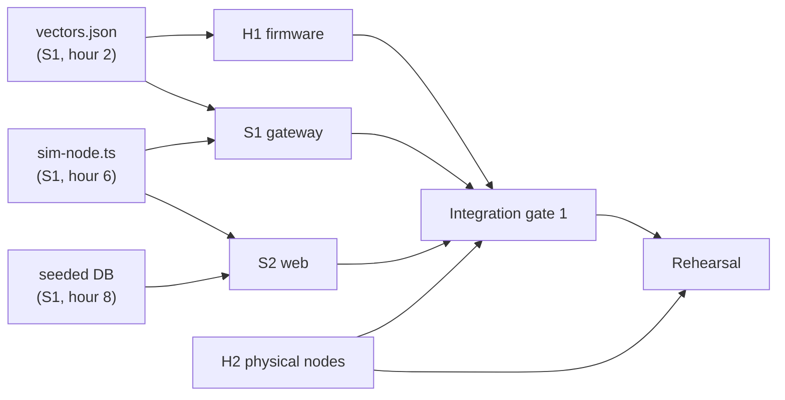

# Team Plan — 4 people, 2 tracks

| Role | Person | Track | Owns |
|---|---|---|---|
| **H1** | Jaideep | Hardware | HEAD firmware (DevKit): identity, signing, hash chain, ring buffer, ESP-NOW rx + WiFi uplink, heartbeat/adaptive-interval |
| **H2** | (friend) | Hardware | LEAF (S2 Lolin) + CAM bring-up, all builds/wiring/power/enclosures, photo-hash + tamper rig, calibration, cold-box, backup boards |
| **S1** | | Software | Protocol companions (CAM/IMU/relay), gateway ingest + verify + consensus breach, Merkle/anchor pipeline, MQTT broker, `sim-swarm.ts` |
| **S2** | | Software | Web twins dashboard (map + 3D-lite + health), phone PWA virtual-node, consumer verify + ops UI, QR/labels, pitch assets |

---

## 1. The one thing that decides whether this ships

Four people working in parallel on a system with a device↔server↔chain seam will lose a full day
to integration unless the seams are frozen **before** anyone writes feature code.

So **Hour 0–2 is a whole-team session with one deliverable: the golden vectors.**
`packages/core/fixtures/vectors.json` is generated and committed, and after that:

- H1 builds firmware against the vectors — no gateway needed.
- S1 builds the gateway against the vectors + `scripts/sim-node.ts` — no hardware needed.
- S2 builds the UI against a seeded database — no gateway needed.
- H2 builds the physical rig against nothing at all.

Everyone is unblocked for the next 20 hours. That is the entire trick.

**Corollary:** nobody changes the protocol alone. A vector change is a whole-team, 5-minute
stand-up decision, because it invalidates work on both sides of the seam simultaneously.

---

## 2. Phase plan

Hour budgets assume a ~48-hour build. Compress or expand proportionally; the **ordering and the
integration gates are what matter**, not the absolute hours.

```mermaid
gantt
    title KrishiChain build
    dateFormat HH
    axisFormat %H

    section Whole team
    P0 Seams frozen (vectors, contracts, repo)   :p0, 00, 2h
    P4 Integration gate 1                        :milestone, 20, 0h
    P6 Integration gate 2 + rehearsal            :milestone, 38, 0h

    section H1 firmware
    Crypto spike (sign benchmark)                :h1a, 02, 3h
    Identity + NVS + canonical record            :h1b, after h1a, 5h
    Hash chain + flash ring buffer               :h1c, after h1b, 5h
    Uplink + store-and-forward                   :h1d, after h1c, 4h
    Tamper + lot binding + LED states            :h1e, after h1d, 4h
    Hardening + power cut soak                   :h1f, 34, 4h

    section H2 hardware
    BOM audit + bench build node A               :h2a, 02, 5h
    Node B + sensor calibration                  :h2b, after h2a, 5h
    Power + battery characterisation             :h2c, after h2b, 4h
    Enclosure, seals, crates, cold box           :h2d, after h2c, 5h
    Demo rig dry runs + backup board             :h2e, 34, 5h

    section S1 chain+gateway
    Contracts + tests                            :s1a, 02, 6h
    Ingest + verify pipeline                     :s1b, after s1a, 5h
    Merkle batcher + anchor service              :s1c, after s1b, 5h
    Rules engine + query API                     :s1d, after s1c, 4h
    Amoy deploy + hardening                      :s1e, 34, 4h

    section S2 web
    Design system + verify page shell            :s2a, 02, 5h
    Client-side proof verification               :s2b, after s2a, 5h
    Ops dashboard + live state                   :s2c, after s2b, 5h
    Charts, labels, handoff                      :s2d, after s2c, 5h
    Polish + deck + rehearsal                    :s2e, 34, 5h
```

### P0 · Hours 0–2 — Seams frozen (all four)

| Output | Owner |
|---|---|
| Repo cloned, `npm install` green on all four machines | S1 |
| `PROTOCOL.md` walked through line by line, out loud | All |
| `packages/core/fixtures/vectors.json` generated and committed | S1 |
| Contract interfaces (function signatures only) committed | S1 |
| `TASKS.md` assigned, everyone knows their next three tickets | All |
| PlatformIO project builds and flashes blink to both boards | H1 |
| BOM audited against what is physically on the table | H2 |

**Gate:** nobody proceeds until `npm test` passes on a clean clone and both ESP32s blink.

### P1 · Hours 2–12 — Parallel build, no integration

Each track works alone against fixtures. Resist the urge to "just quickly test it together" —
that is what P4 is for, and premature integration destroys four people's flow at once.

### P2 · Hours 12–20 — Feature completion of P0 requirements

### P4 · Hour 20 — **Integration gate 1** (the whole team stops)

The only agenda: a real ESP32 posts a real record to the real gateway, and it verifies.
Budget 3 hours. It will not work the first time; that is why it is scheduled at hour 20 and not
hour 40.

Exit criteria:
- [ ] A physical node's record passes signature + chain verification
- [ ] A batch anchors on the local chain
- [ ] The consumer page shows one real reading with a green badge

### P5 · Hours 23–38 — P1 features, on the real system

### P6 · Hour 38 — **Integration gate 2 + rehearsal**

- [ ] Full demo script run end to end, twice, timed
- [ ] Offline test, tamper test, unverifiable test all pass
- [ ] Amoy deployment live with an explorer link in the deck
- [ ] Backup board flashed, fallback video recorded

### P7 · Hours 41–48 — Freeze, polish, sleep

**Code freeze at hour 44.** Only demo-breaking bugs after that. The most common way hackathon
teams lose is a "small improvement" at hour 46.

---

## 3. Who does what, in detail

### H1 — Jaideep · Firmware & device trust

You own the hardest correctness problem in the project: making a $3 microcontroller produce
evidence. Work at a desk with a dev board and a USB cable; you do not need the bench.

| Order | Ticket | Why this order |
|---|---|---|
| 1 | `H1-01` secp256k1 sign benchmark on ESP32 | If signing is 400 ms not 40 ms, the whole design changes. Find out in hour 3, not hour 30. |
| 2 | `H1-02` Identity: TRNG keygen, encrypted NVS, address derivation | Everything downstream needs a device address |
| 3 | `H1-03` Canonical 90-byte record packing | Must match the vectors byte for byte |
| 4 | `H1-04` Sign + verify against golden vectors (native test) | Proves the seam before any radio is involved |
| 5 | `H1-05` Hash chain state in NVS | The core intellectual claim of the project |
| 6 | `H1-06` Flash ring buffer, crash-safe | The offline demo lives here |
| 7 | `H1-07` Uplink + `ackSeq` flow control + backoff | |
| 8 | `H1-08` Store-and-forward drain | The WiFi-pull demo moment |
| 9 | `H1-09` Sensor abstraction + DHT22 driver | Merge with H2's wiring |
| 10 | `H1-10` Tamper channel + `flags` | |
| 11 | `H1-11` Lot binding | |
| 12 | `H1-12` LED/OLED state machine | Judges read the LED before they read the screen |
| 13 | `H1-13` Power-cut soak test (100 cycles) | Turns a claim into a measurement |

**Your integration partner is S1.** You two co-own `PROTOCOL.md`. Pair for gate 1.

### H2 — Physical build, power & the demo rig

You own "it works on the table in front of a judge", which is a different discipline from "it
works". A perfect system with a loose DuPont wire scores zero.

| Order | Ticket | Notes |
|---|---|---|
| 1 | `H2-01` Inventory + BOM audit with real prices | Feeds PRD §10.1 — judges will ask about cost, and estimates read as guesses |
| 2 | `H2-02` Node A bench build (farm) | Soldered, not breadboarded, wherever possible |
| 3 | `H2-03` Node B bench build (transit) | |
| 4 | `H2-04` Sensor calibration vs a reference thermometer | Produces the numbers for the calibration record |
| 5 | `H2-05` Power: battery, charging, current draw at each state | `hardware/POWER.md` |
| 6 | `H2-06` Enclosure + tamper seal with a printed seal ID | The seal is a *prop that is also real* |
| 7 | `H2-07` Cold box rig: ice packs, thermal mass, repeatable breach | The breach must take ~90 s on demand, not 20 minutes |
| 8 | `H2-08` Crates, printed QR labels, staging layout | With S2 |
| 9 | `H2-09` Backup board, pre-flashed and pre-registered | Non-negotiable |
| 10 | `H2-10` Two full timed dry runs | You call the demo; you know the props |

**If you finish early:** own the fallback video and the physical one-pager for the judges' table.

### S1 — Chain, gateway & core

You own the verification pipeline — the part that turns signed bytes into a claim anyone can
check.

| Order | Ticket |
|---|---|
| 1 | `S1-01` `packages/core`: canonical encode/decode + digest |
| 2 | `S1-02` Golden vector generator + `vectors.json` (**hour 2 deliverable, blocks H1**) |
| 3 | `S1-03` Contracts: `ActorRegistry`, `DeviceRegistry` + tests |
| 4 | `S1-04` Contracts: `LotRegistry`, `BatchAnchor` + tests |
| 5 | `S1-05` `scripts/sim-node.ts` — a fake node that speaks the protocol (**unblocks S2 and yourself**) |
| 6 | `S1-06` Gateway ingest + signature verification + quarantine |
| 7 | `S1-07` Hash-chain state machine + incidents |
| 8 | `S1-08` Merkle batcher + proof storage |
| 9 | `S1-09` Anchor service with nonce management + retry |
| 10 | `S1-10` Rules engine → `flagLot` |
| 11 | `S1-11` Query API: lot journey, proofs, recall subtree |
| 12 | `S1-12` EPCIS 2.0 projection |
| 13 | `S1-13` Amoy deployment + funded key (**do this at hour 30, not hour 46**) |

**Ship `S1-02` and `S1-05` early even if rough.** They are not your features; they are two other
people's unblocking.

### S2 — Web, verification UX & the pitch

Two of four judges will experience this project almost entirely through your screen. A
fullstack-influencer judge will notice a default Tailwind card grid instantly.

| Order | Ticket |
|---|---|
| 1 | `S2-01` Design language: type scale, colour, the badge system. Not a component library dump |
| 2 | `S2-02` `/verify/[lotId]` shell + journey timeline against seeded data |
| 3 | `S2-03` **Client-side Merkle verification** with a visible, honest progress state |
| 4 | `S2-04` Four badge states, including a designed `UNVERIFIABLE` |
| 5 | `S2-05` Cold-chain chart with the breach window highlighted |
| 6 | `S2-06` Ops dashboard: node health, buffer depth, last-seen, incidents |
| 7 | `S2-07` Live updates (poll 3 s is fine; do not build a socket layer) |
| 8 | `S2-08` QR + crate label sheet |
| 9 | `S2-09` Custody handoff with wallet signature |
| 10 | `S2-10` Mobile pass: 360 px, one-handed, high contrast |
| 11 | `S2-11` Deck + the 90-second script |

**The single highest-value screen** is `/verify/[lotId]` on a phone. Build it mobile-first and
make the verification step *visible* — a judge watching a proof recompute in the browser is the
moment the project stops sounding like a buzzword.

---

## 4. Dependency graph

Three artefacts unblock everyone: **vectors**, **sim-node**, **seeded DB**. All three are S1's,
all three are due in the first 8 hours, and all three are more important than any contract S1
writes.

---

## 5. Working agreements

- **Stand-up every 4 hours, 5 minutes, standing.** Three sentences each: done / next / blocked.
- **Blocked > 20 minutes → say it out loud.** Silent blocking is the top killer of hackathon teams.
- **One ticket → one branch → one PR.** `main` stays demo-able at all times, always.
- **Push at least hourly.** An unpushed laptop is a single point of failure for the whole team.
- **Protocol changes are a team decision.** See §1.
- **Anyone may call a 10-minute "is this still P0?" check** if a task has doubled its estimate.

### Claude Code discipline

- Everyone works in their own directory scope; two agents editing `packages/core` at once will
  produce conflicts you will debug at 3 a.m.
- Start every session by pointing Claude at [CLAUDE.md](../CLAUDE.md) and the ticket ID.
- Tickets in [TASKS.md](../TASKS.md) are written to be pasted directly into Claude Code — each
  has a scope, files, acceptance criteria and explicit non-goals.
- **Review the diff before you commit it.** The judge asking "walk me through this file" is the
  single most common way AI-heavy hackathon teams lose; you must be able to explain every line
  you shipped.

---

## 6. If you fall behind

Cut in exactly this order. Do not improvise this at hour 40 — the ordering is designed so each
cut removes work without removing the story.

1. Map view, audit export, localisation (P2 — already out)
2. EPCIS projection (keep the *mapping table* in the deck; it still scores)
3. Custody handoff wallet signature → replace with a server-side signed handoff
4. Ops dashboard live updates → manual refresh button
5. Amoy deployment → local chain only, and say so honestly
6. Second node → run one node and simulate the second with `sim-node.ts`, disclosed on the slide

**Never cut:** device signing, the hash chain, the offline buffer, client-side verification.
Those four *are* the project. Everything else is presentation.
